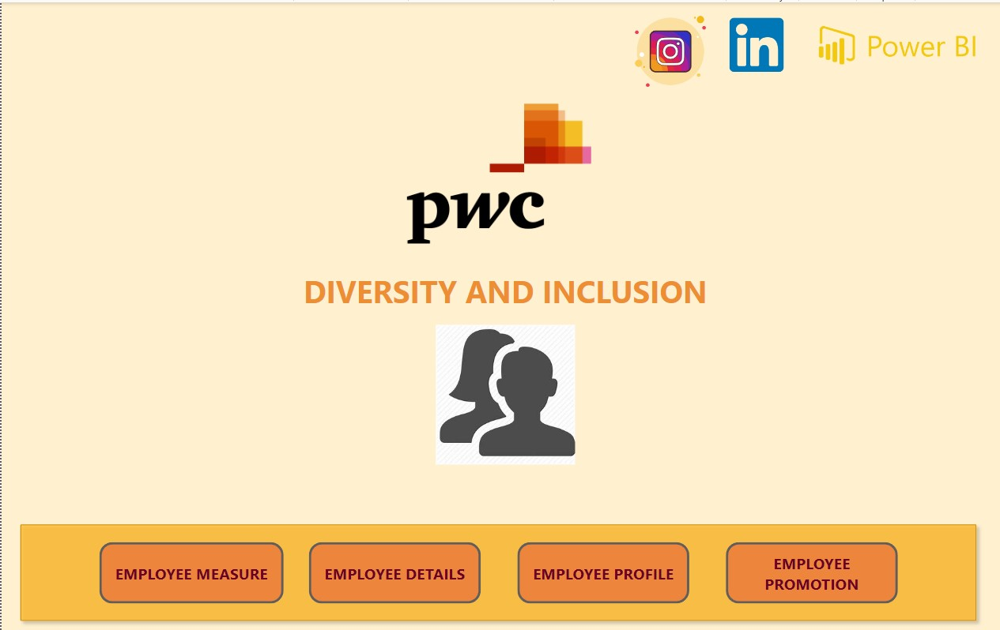

# Diversity and Inclusion Analysis

## Table of Content

- [Diversity and Inclusion Analysis](#Diversity-and-Inclusion-Analysis)
  - [Table of Content](#table-of-content)
  - [Dataset](#dataset)
  - [Task Details](#task-details)
    - [Email message](#email-message)
    - [Task Information](#task-information)
  - [Tools](#tools)
  - [Dashboard](#dashboard)
  - [Contributors](#contributors)

## Dataset

It consists of 1 excel file contains 1 sheet only
`Diversity_and_Inclusion_Analysis.xlsx`

## Task Details

Calculating the following measures could help to define proper KPIs:

- Number of men
- Number of women
- Number of leavers
- % employees promoted (FY21)
- % of women promoted
- % of hires men
- % of hires women
- % turnover 2020
- Average performance rating: men
- Average Performance rating: women

### Task Information
*Your colleague, the engagement partner, asks you to do the following tasks:-*

**Define relevant KPIs in**
- hiring 
- promotion
- performance
- turnover
**and create a visualisation Write what you think some root causes of their slow progress might be**

## Tools

## Dashboard

**PowerBi File**

**Home Page**

**Employee Measure Analysis Dashboard**
.jpg)

**Employee Details Analysis Dashboard**
.jpg)

**Employee Profile Analysis Dashboard**
.jpg)

**Employee Promotion Analysis Dashboard**
.jpg)

## Connect With me

Rajdeep kangsha Banik 

